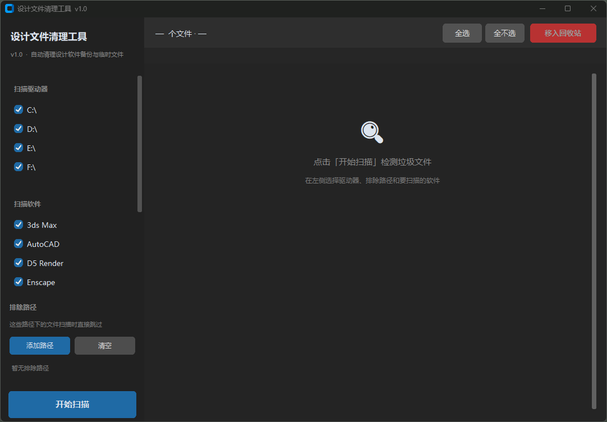

# 设计文件清理工具

> 设计师专用，一键清理设计软件产生的备份和临时文件，释放硬盘空间。

---

## 截图



---

## 支持的软件

SketchUp · Rhino · AutoCAD  · 3ds Max · Lumion · D5 Render · Enscape · Photoshop · Illustrator · InDesign

**只清理软件自动产生的备份和缓存，不会碰你的正稿文件**（.skp / .3dm / .dwg / .max / .psd / .ai / .indd 等均不在清理范围内）。

---

## 下载和使用

### 方式一：直接下载 exe（推荐，无需安装任何环境）

1. 点击右侧 **Releases**，下载 `DesignCleaner.exe`
2. 双击运行即可，无需安装

点击链接下载
https://github.com/luoali/design-cleaner/releases/tag/v1.0

### 方式二：运行源码（需要 Python 环境）

```bash
# 安装依赖
pip install customtkinter send2trash

# 运行
python design_cleaner.py
```

---

## 使用说明

1. **选择驱动器**：左侧自动列出电脑上所有磁盘，取消勾选不想扫的盘
2. **选择软件**：取消勾选不需要扫描的软件
3. **排除路径**（可选）：把「归档」「交付文件」等重要文件夹加进去，扫描时自动跳过
4. 点击「**开始扫描**」，扫描过程中可以随时暂停或停止
5. 扫描完成后，默认全部勾选，取消不想删的条目
6. 点击「**移入回收站**」—— 文件先进回收站，确认没问题再清空回收站

---

## 清理的文件类型

| 软件 | 清理内容 |
|------|---------|
| SketchUp | `.skb` 自动备份、`.skp.lock` 锁文件 |
| Rhino / Grasshopper | `.3dmbak` 备份、崩溃恢复文件、GH 几何缓存 |
| AutoCAD / Civil 3D | `.bak` 备份、`.sv$` 自动保存、`.lck` 锁文件 |
| 3ds Max | autoback 目录、`.xbk` 增量备份、V-Ray 网格缓存 |
| Lumion | 场景缓存目录 |
| D5 Render | 同步临时目录、素材缓存 |
| Enscape | 场景缓存、资产缓存 |
| Photoshop | `.psd~` / `.psb~` 备份（非正稿） |
| Illustrator | `~*.ai` 临时文件、崩溃恢复目录 |
| InDesign | `~*.indd` 临时文件、`.idlk` 锁文件、崩溃恢复目录 |

---

## 注意事项

- 标注「**需确认**」的文件（如崩溃恢复文件）建议先手动确认内容再删
- 移入回收站后仍可恢复，彻底删除前可以去回收站检查
- 排除路径设置会自动保存，下次打开还在

---

## 常见问题

**Q：会不会删掉我的正稿？**
不会。程序只识别特定后缀的备份和临时文件，正稿（.skp / .3dm / .dwg 等）的后缀不在规则里。

**Q：扫描很慢怎么办？**
可以取消勾选不需要扫的盘（比如系统盘 C 盘项目文件少），只扫存项目的盘速度会快很多。

**Q：排除路径是什么意思？**
把你的「归档」「甲方交付」等重要文件夹路径加进去，即使里面有匹配规则的文件名，也会被跳过，不会误删。

---

## 反馈问题

欢迎在 [Issues](../../issues) 里提问题或建议，也可以直接提 PR。

---

## License

MIT License · 免费使用，可自由修改和分发
